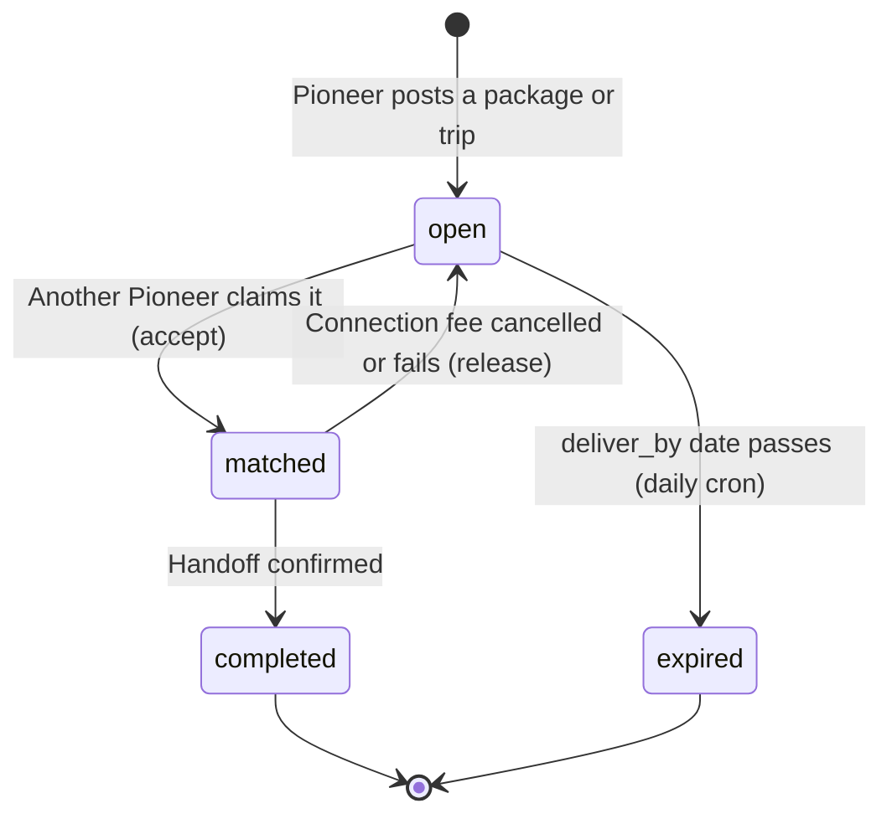
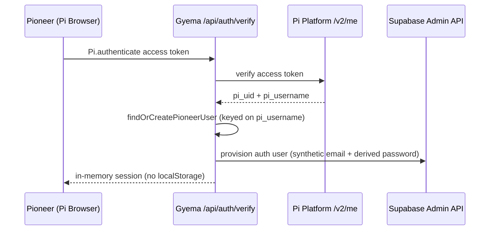
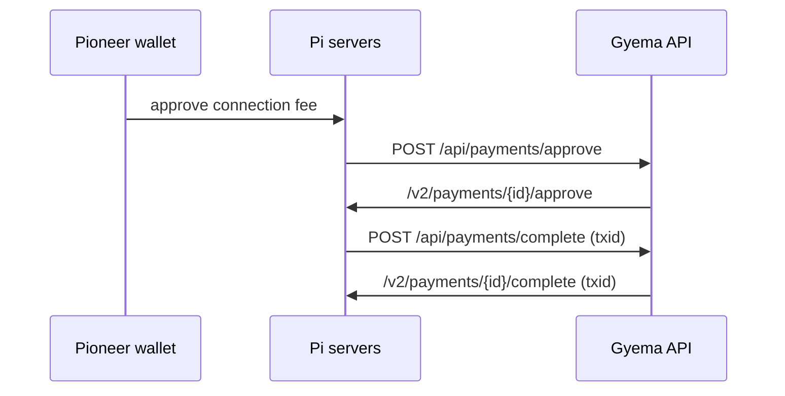
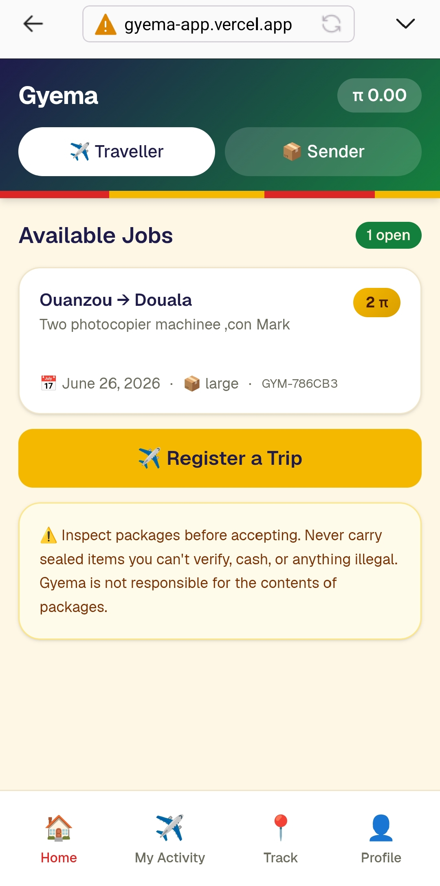
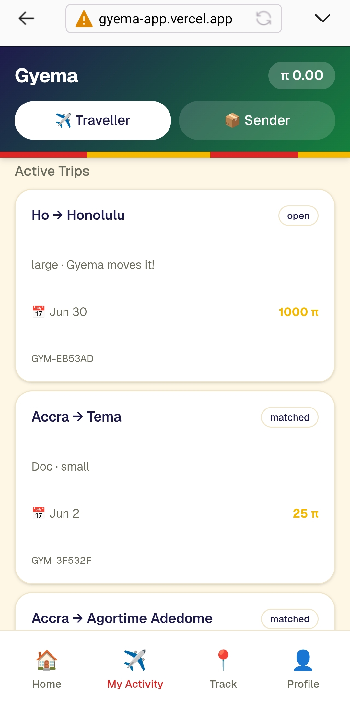
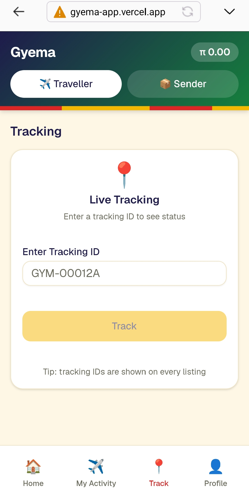
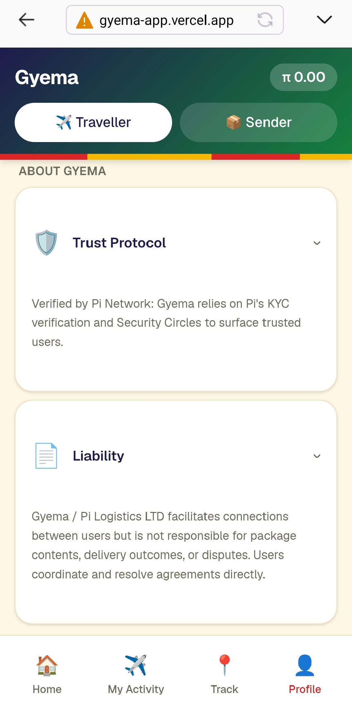

# Gyema

**Peer-to-peer delivery on Pi Network, built in Ghana for the world.**

Gyema connects two sides of every delivery: Senders with packages to move, and Travellers already making the trip. Pi is the payment rail. The platform runs on Pi Testnet today and is built to migrate to Mainnet once the Pi Core Team enables Soroban deployment for third-party apps.

- Production: [gyema-app.vercel.app](https://gyema-app.vercel.app)
- V2 escrow contracts: [tsotsoobi/gyema-contracts](https://github.com/tsotsoobi/gyema-contracts)
- Company: [Pi Logistics Ltd.](https://pillgh.com)

---

## What Gyema does

A Sender posts a package with a route and a fee in Pi. A Traveller already heading that way claims it. The two are connected, settle a connection fee in Pi, then coordinate the handoff over WhatsApp. Because the trip was happening anyway, the delivery avoids a dedicated vehicle run, which Gyema also tracks as avoided carbon.

Two roles, toggled in the app header:

- **Sender** posts a delivery (package, route, fee in Pi).
- **Traveller** posts a trip and accepts matching deliveries.

Listings persist server-side in Supabase. Tracking IDs are issued as `GYM-XXXXXX`.

### Listing lifecycle



The claim is atomic and server-side. Only an `open` listing can be claimed, and a Pioneer cannot accept their own listing. If the connection-fee payment is cancelled or fails after a claim, the listing is released back to `open` so it is never left matched but unpaid.

---

## Features

- **Role-based listings.** One Pioneer can act as both Sender and Traveller, switching in the header.
- **Server-side atomic claim.** `/api/listings/accept` verifies the accepter from their Supabase session token (never a client-supplied id) and claims the row only if it is open and not their own.
- **Self-healing matches.** `/api/listings/release` reverts a matched-but-unpaid listing to open if the connection fee falls through.
- **Daily stale-listing sweep.** A Vercel cron expires `open` listings past their `deliver_by` date, computed against the Africa/Accra clock, protected by a `CRON_SECRET` bearer token.
- **Guest browsing.** Anyone can browse trips and packages. Posting or accepting requires a Pi identity, gated in place so a guest can upgrade without losing context.
- **WhatsApp coordination.** The accepter's WhatsApp number is captured at claim time so the two parties can arrange the physical handoff directly.
- **Carbon impact.** Each delivery estimates CO2 avoided versus a dedicated trip, split evenly between Sender and Traveller. See the methodology section below.
- **V1 Pi payments.** Connection fees settle through the official Pi SDK with server-side approval and completion.
- **Legal and methodology pages.** Static `/privacy.html`, `/terms.html`, and `/methodology.html` ship with the app.

---

## Architecture

### Stack

| Layer | Technology |
|---|---|
| Framework | Next.js 15 (App Router), React 19 |
| Hosting | Vercel (Node.js runtime for admin routes; cron via `vercel.json`) |
| Auth and data | Supabase (Postgres, asymmetric ECC P-256 JWT signing) |
| Identity provider | Pi Network SDK (`Pi.authenticate` then Pi Platform `/v2/me`) |
| UI | Tailwind CSS 4, shadcn/ui on Radix primitives, Geist font, Sonner toasts |
| Validation | Zod |
| V2 escrow (in development) | Soroban smart contracts on Pi Mainnet (Protocol 23+) |

### Pi to Supabase auth bridge

The non-trivial piece. Pi issues access tokens for Pioneers; Supabase requires its own JWTs signed with ECC P-256. The bridge reconciles the two.



Key files: `lib/pi-platform.ts` (Pi `/v2/me` verification), `lib/supabase-admin.ts` (admin-API provisioning), `app/api/auth/verify/route.ts` (the bridge endpoint), `lib/pi-network.ts` (client-side Pi SDK wrapper), `lib/supabase.ts` (Supabase client).

### Why username-keyed reconciliation

Pi Testnet rotates `pi_uid` values across sessions for the same Pioneer. `pi_username` is the stable identity anchor. `findOrCreatePioneerUser` resolves identity in three tiers: indexed lookup on `pi_username` (primary), indexed lookup on `pi_uid` (legacy compatibility), then a `listUsers` fallback that defends against schema drift. The function returns the canonical `pi_uid` stored in the Pioneer row, which session creation must use. Passing the rotated session-time uid would authenticate against the wrong `auth.users` record.

This is platform behavior that is not documented and only surfaces under real user load. If you build on Pi: never key user reconciliation on `pi_uid`.

### Supabase Auth storage

Supabase Auth users are provisioned with synthetic non-routable emails (`pi-{uid}@gyema.local`, using the reserved `.local` TLD) and deterministic HMAC-SHA256-derived passwords keyed by a server secret. The real auth gate is Pi KYC; Supabase Auth is session storage.

### Payment flow (V1)

V1 settles connection fees through the official Pi SDK. Pi servers call Gyema's routes, which relay to the Pi Platform API.



### Observability

Every auth bridge call writes to an `auth_events` table with `pi_uid_prefix`, `pi_username`, `supabase_user_id_prefix`, a `user_created` flag, `error_message`, `elapsed_ms`, and a `metadata` jsonb field (including a `pi_uid_rotated` diagnostic flag).

---

## API routes

| Method | Route | Purpose |
|---|---|---|
| POST | `/api/auth/verify` | Pi to Supabase auth bridge |
| POST | `/api/listings/accept` | Atomic server-side claim of an open listing |
| POST | `/api/listings/release` | Revert the caller's matched-but-unpaid claim to open |
| POST | `/api/payments/approve` | Relay Pi payment approval to the Pi Platform API |
| POST | `/api/payments/complete` | Relay Pi payment completion (with txid) to Pi |
| GET | `/api/cron/expire-stale-listings` | Daily sweep of stale open listings (cron only) |

---

## Repository layout

```
gyema-app/
├── app/
│   ├── api/
│   │   ├── auth/verify/route.ts
│   │   ├── cron/expire-stale-listings/route.ts
│   │   ├── listings/accept/route.ts
│   │   ├── listings/release/route.ts
│   │   └── payments/{approve,complete}/route.ts
│   ├── layout.tsx
│   └── page.tsx
├── components/
│   ├── app-header.tsx, bottom-nav.tsx, sign-in.tsx, welcome-sheet.tsx
│   ├── home-tab.tsx, trips-tab.tsx, track-tab.tsx, profile-tab.tsx
│   ├── listing-detail-sheet.tsx, guest-post-gate.tsx
│   └── ui/                       shadcn primitives
├── lib/
│   ├── pi-network.ts             client-side Pi SDK wrapper
│   ├── pi-platform.ts            Pi /v2/me verification
│   ├── supabase.ts               Supabase client
│   ├── supabase-admin.ts         admin-API provisioning
│   ├── jwt.ts                    Supabase JWT signing
│   ├── listings.ts, listings-async.ts
│   └── carbon.ts                 carbon impact math
├── public/                       icons, methodology.html, privacy.html, terms.html
├── vercel.json                   cron schedule
└── package.json
```

---

## Local development

Prerequisites: Node.js 18+ and a Supabase project plus a Pi Developer Portal app (sandbox).

```bash
git clone https://github.com/tsotsoobi/gyema-app.git
cd gyema-app

npm install
cp .env.example .env.local   # fill in the values below

npm run dev                  # http://localhost:3000
```

Other scripts: `npm run build`, `npm run start`, `npm run lint`.

The Pi SDK only runs inside the Pi Browser. Opened in a normal browser, `window.Pi` is undefined and the app falls back to a guest or demo experience, so most UI is browsable outside Pi but live authentication and payments are not.

### Environment variables

| Variable | Purpose |
|---|---|
| `NEXT_PUBLIC_SUPABASE_URL` | Supabase project URL |
| `NEXT_PUBLIC_SUPABASE_ANON_KEY` | Supabase anon key (client) |
| `SUPABASE_SERVICE_ROLE_KEY` | Supabase admin key (server routes only) |
| `PI_API_KEY` | Server-side Pi Platform API key |
| `PIONEER_PASSWORD_SALT` | Secret for deriving Supabase passwords |
| `CRON_SECRET` | Bearer token the Vercel cron must present |

Testnet versus Mainnet is controlled in the Pi Developer Portal app configuration and read from the Pi SDK at runtime.

---

## Carbon methodology

Carbon math lives in `lib/carbon.ts` and is fully explained at `/methodology.html`. In short: a baseline of 130 g CO2 per km (the average of a motorbike at roughly 80 and a car at roughly 180, reflecting Ghana's mixed last-mile fleet), applied to a straight-line haversine distance multiplied by a 1.3 road-correction factor, with the avoided emissions split 50/50 between Sender and Traveller. Unknown cities return zero rather than guessing. V2 will replace the city table with real geocoding and the correction factor with actual route distances.

---

## V2: on-chain escrow

V1 uses `Pi.createPayment()` for delivery payments. V2 introduces a three-pot escrow with rider performance bonds and admin-arbitrated dispute resolution, deployed as Soroban smart contracts on Pi Mainnet. Highlights: customer-confirms-primary release with a rider timeout fallback, atomic two-sided funding, either-party dispute within the confirmation window, explicit allocation in disputes, and self-deal blocked at the contract level. Full source and rationale at [gyema-contracts](https://github.com/tsotsoobi/gyema-contracts).

V2 deployment begins after the gyema.pi domain claim (target December 19, 2026) and once the Pi Core Team enables Soroban deployment for third-party apps.

---

## Roadmap

- **V1 (current):** live on Pi Testnet. Server-side payments, atomic matching, cron expiry, carbon tracking.
- **V2 (post Pi Mainnet Soroban access):** wire the escrow contracts into the matching flow, audit, migrate.
- **V3:** real route geocoding for carbon, ecosystem composability.

---

## Status

- **Network:** Pi Testnet (Protocol 23)
- **Pi ecosystem rating:** 4.8 stars across 430 raters (as of June 19, 2026)
- **Actively staked:** 57,603.60 Pi in the Pi ecosystem directory (as of June 19, 2026)
- **First completed delivery:** GYM-719D42, Accra to Tema, 2026-05-07

---

## Screenshots

<p>
  
  
  
  
</p>

_Home, My Activity, Track, and Profile tabs (Pi Testnet)._

---

## Changelog

See commit history for full detail. Notable V1 milestones:

- Server-side payment approval and completion routes
- Atomic server-side listing claim with release-on-failed-payment safeguard
- Daily cron sweep for stale listings (moved off the old client-side sweep)
- Carbon impact module with Ghana city table and methodology page
- Guest browsing with in-place upgrade gate
- Pi `pi_uid` rotation handled via username-keyed reconciliation

---

## License

Copyright (c) 2026 Pi Logistics Ltd. All rights reserved.
